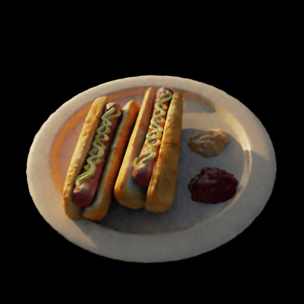

# Investigating realtime capabilities of DSNeRF

[**Project**](https://bussler.github.io/#/dsnerf) | [**Paper**](https://bussler.github.io/wp-content/uploads/2022/08/3D_Machine_Learning_DSNERF_Project_Final_Report.pdf)

Depth-supervised NeRF (DSNeRF) is a state of the art deep neural network method for implicit 3D scenes representation from multi-view inputs.
This project analyses the impact of different Fourier Feature mappings ([Original Positional Encoding](https://github.com/dunbar12138/DSNeRF), [Gauss Mapping](https://github.com/tancik/fourier-feature-networks)) and the [SIREN](https://github.com/vsitzmann/siren) and [SINONE](https://github.com/alextrevithick/Periodic-Activations) networks on the rendering quality of DSNeRF.
The code base was taken from https://github.com/dunbar12138/DSNeRF.
The files run_nerf.py and run_nerf_helpers.py (implement Gauss mapping) were modified.
The files SSIMGenerator.py (calculate SSIM metric), SirenDsnerf.py (Implement SIREN and SINONE Networks) were added.

The branch *FastNeRF* implements a caching technique like proposed in [FastNeRF](https://openaccess.thecvf.com/content/ICCV2021/papers/Garbin_FastNeRF_High-Fidelity_Neural_Rendering_at_200FPS_ICCV_2021_paper.pdf) in order to enable an interactive implementation of FastNeRF.

## Results

Positional Encoding        |  Gauss Mapping            | SINONE                    |  SIREN         |
:-------------------------:|:-------------------------:|:-------------------------:|:-------------------------:|
  |   |  | 

Positional Encoding        |  Gauss Mapping            
:-------------------------:|:-------------------------:
  |  

Gauss Mapping produces smoother renderings with fewer artifacts and captures the overall object shapes better than the original Positional Encoding.
The periodic activation functions of SIREN and SINONE behave unstable during training and are unable to capture the original 3D scene well.

*FastNeRF* proposes a network split that separates the original DSNeRF into two networks. This new network architecture requires a three-dimensional and a two-dimensional input instead of a five-dimensional one and thereby enables feasible caching. Since a volume renderer is able to fall back on the cache and does not have to query the network at rendering time, interactive rendering speeds at 30fps can be achieved.

## Quick Start

### Data
[Datasets](https://drive.google.com/drive/folders/14boI-o5hGO9srnWaaogTU5_ji7wkX2S7) for all experiments.

### Train and run the network:
1. Install the requirements from requirements.txt.
2. Use [COLMAP](https://github.com/colmap/colmap) to generate the camera poses and sparse depth information of a downloaded dataset.
3. Use `python imgs2poses.py <your_scenedir>` to generate the poses and sparse point cloud.
4. Create a config file like the examples in `./configs` and store the relative path to the data.
5. Train the network  with `python run_nerf.py --config configs/<config_file.txt>`. This will create a directory in `./logs` with checkpoints and rendering examples.
6. Test the network with `python run_nerf.py --config configs/<config_file.txt> --render_only`.
