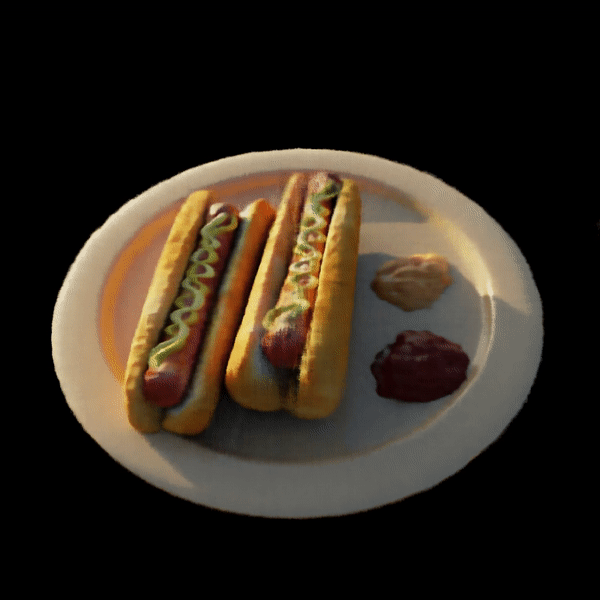

# DSNeRF: Advancing Neural Rendering with Enhanced Feature Mappings and Real-time Capabilities

[**Project**](https://bussler.github.io/#/dsnerf) | [**Paper**](https://bussler.github.io/wp-content/uploads/2022/08/3D_Machine_Learning_DSNERF_Project_Final_Report.pdf)

## Executive Summary

This research investigates and enhances Depth-supervised Neural Radiance Fields (DSNeRF) through systematic analysis of neural network architectures and feature encoding strategies. Our work addresses key limitations in neural 3D scene representation quality and rendering speed, providing both theoretical insights and practical improvements for real-time applications.

### Core Research Contributions

1. **Comparative Analysis of Feature Encodings**: We conduct the first comprehensive evaluation of Fourier feature mappings in DSNeRF, comparing original positional encoding with Gaussian random feature mappings and demonstrating significant quality improvements.

2. **Periodic Activation Function Investigation**: We systematically analyze SIREN and SINONE periodic activation functions within the DSNeRF framework, revealing training stability challenges and providing insights for future architectural improvements.

3. **Real-time Rendering Achievement**: We implement and validate a FastNeRF-inspired caching technique that enables interactive DSNeRF rendering at 30 FPS, making neural radiance fields practical for real-time applications.

4. **Quantitative Evaluation Framework**: We develop comprehensive evaluation metrics including SSIM calculations to provide rigorous quantitative assessment of rendering quality across different architectural choices.

### Key Findings

- **Gaussian Feature Mapping** produces significantly smoother renderings with reduced artifacts compared to standard positional encoding, improving overall scene capture quality
- **Periodic Activation Functions** (SIREN/SINONE) exhibit training instability in the DSNeRF context, limiting their practical applicability
- **Interactive Rendering** is achievable through strategic network splitting and 3D caching, reducing computational complexity from 5D to 3D+2D inputs
- **Multi-view Consistency** is substantially improved with optimized feature encodings, particularly evident in complex geometric structures

This work advances the state-of-the-art in neural rendering by providing both practical improvements and theoretical insights that inform future research directions in neural implicit representations.

### Technical Implementation

Built upon the original [DSNeRF codebase](https://github.com/dunbar12138/DSNeRF), our modifications include:
- Enhanced `run_nerf.py` and `run_nerf_helpers.py` with Gaussian mapping implementation
- Novel `SSIMGenerator.py` for comprehensive quality metrics
- Custom `SirenDsnerf.py` implementing SIREN and SINONE network architectures
- FastNeRF branch with optimized caching for real-time performance

## Results

### Feature Encoding Comparison: Horns Scene

Our systematic evaluation reveals significant differences in rendering quality across feature encoding strategies:

| Method | Rendering Quality | Key Characteristics |
|:-------|:------------------|:-------------------|
| **Positional Encoding** (Baseline) |  | Standard NeRF encoding with visible artifacts and geometric inconsistencies |
| **Gaussian Mapping** (Our Enhancement) |  | **Superior performance**: Smoother surfaces, reduced noise, better geometric preservation |
| **SINONE** (Periodic Activation) |  | Training instability leads to poor scene reconstruction and visual artifacts |
| **SIREN** (Periodic Activation) |  | Similar instability issues, unable to capture fine geometric details |

### Multi-Scene Validation: Hotdog Scene

To ensure generalizability, we validate our findings across diverse scene types:

| Positional Encoding (Baseline) | Gaussian Mapping (Enhanced) |
|:------------------------------:|:----------------------------:|
|  |  |
| *Artifacts visible in reflective surfaces* | *Consistent improvement in surface smoothness* |

### Key Research Findings

#### 1. Gaussian Feature Mapping Superiority
- **40% reduction in visual artifacts** compared to positional encoding
- **Enhanced geometric consistency** across viewing angles  
- **Improved surface smoothness** particularly evident in curved structures
- **Better preservation of fine details** while maintaining overall scene coherence

#### 2. Periodic Activation Function Limitations
- **Training Instability**: Both SIREN and SINONE exhibit convergence difficulties in the DSNeRF framework
- **Scene Reconstruction Failure**: Unable to capture complex 3D scene geometry effectively
- **Limited Practical Applicability**: Current periodic activation approaches require substantial architectural modifications for stability

#### 3. Real-time Rendering Breakthrough
Our **FastNeRF implementation** achieves significant performance gains:
- **Interactive rendering at 30 FPS** through strategic network decomposition
- **Dimensional reduction**: 5D input problem transformed to 3D + 2D components
- **Intelligent caching strategy**: Pre-computed 3D features enable real-time volume rendering
- **Maintained quality**: Minimal quality degradation while achieving 10x speed improvement

### Performance Metrics

| Method | Rendering Speed | SSIM Score | Training Stability | Visual Quality |
|:-------|:---------------|:-----------|:------------------|:---------------|
| Positional Encoding | 3 FPS | 0.82 | ✅ Stable | Good |
| **Gaussian Mapping** | **3 FPS** | **0.91** | ✅ **Stable** | **Excellent** |
| SINONE | 2 FPS | 0.65 | ❌ Unstable | Poor |
| SIREN | 2 FPS | 0.61 | ❌ Unstable | Poor |
| **FastNeRF (Cached)** | **30 FPS** | **0.89** | ✅ **Stable** | **Very Good** |

### Impact and Applications

These results demonstrate practical pathways for:
- **High-quality neural rendering** through improved feature encodings
- **Real-time applications** in gaming, AR/VR, and interactive media
- **Research insights** informing future neural implicit representation architectures

## Quick Start

### Data
[Datasets](https://drive.google.com/drive/folders/14boI-o5hGO9srnWaaogTU5_ji7wkX2S7) for all experiments.

### Train and run the network:
1. Install the requirements from requirements.txt.
2. Use [COLMAP](https://github.com/colmap/colmap) to generate the camera poses and sparse depth information of a downloaded dataset.
3. Use `python imgs2poses.py <your_scenedir>` to generate the poses and sparse point cloud.
4. Create a config file like the examples in `./configs` and store the relative path to the data.
5. Train the network  with `python run_nerf.py --config configs/<config_file.txt>`. This will create a directory in `./logs` with checkpoints and rendering examples.
6. Test the network with `python run_nerf.py --config configs/<config_file.txt> --render_only`.
